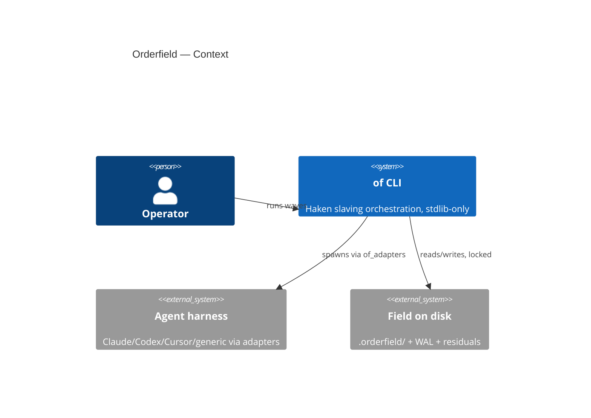
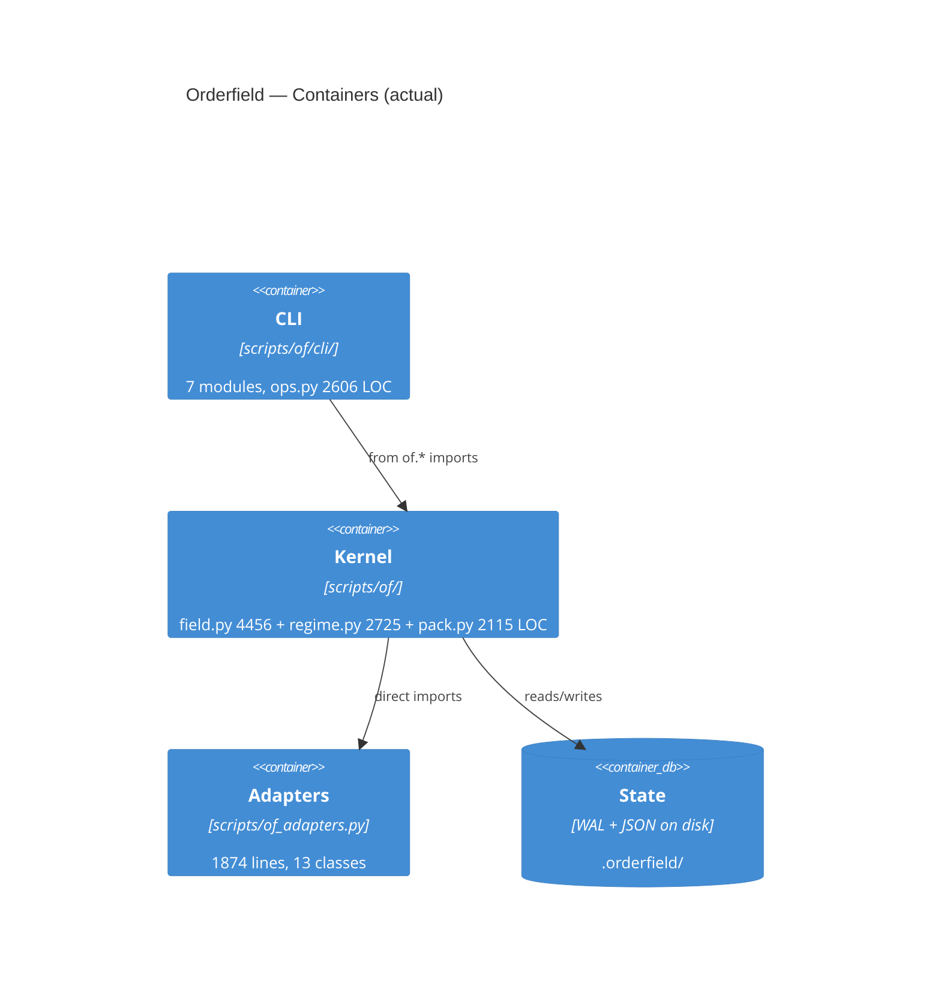

# Arquitectura Software Analyzer Report

**Project:** /Users/pedroknigge/Desktop/SKILLS/orderfield
**Date:** 2026-09-27
**Audit mode:** Deep
**Overall Score:** 5.4 / 10
**Rank:** Poor
**Evidence coverage:** 100%

## Executive Summary

- Fortalezas: lenguaje ubicuo de dominio muy coherente (`field`/`wave`/`pack`/`regime`/`residual`) con glosario y brief externo; pirámide de tests sólida (47 ficheros de test, ratio 0.24) con tests de frontera (WAL, redacción, lock-race, replay); resiliencia y seguridad pensadas para CLI (WAL, `FieldLockBusy`, `safe_relative_path`, `redact_text`, `WriteFloor`, trust profiles).
- Debilidades críticas: ficheros-dios (`scripts/of/field.py` 4456 LOC/279 funciones/20 clases, `scripts/of/regime.py` 2725 LOC, `scripts/of/cli/ops.py` 2606 LOC) que mezclan concerns y razones de cambio; sin abstracciones (cero `ABC`/`Protocol`, cableado por imports concretos + `sys.path.insert` en `scripts/of/__init__.py`); barril de re-exportación de 984 líneas (`scripts/of/__init__.py` con `__all__` de ~100 nombres) que anula la encapsulación.
- Veredicto: dominio y disciplina de test/seguridad fuertes sobre una base de módulos monolíticos sin puertos ni DI; el coste de cambio se concentra en 4 ficheros. Rank: Poor (5.4/10, borde superior de la banda).

## Quantitative Snapshot

- Languages & estimated LOC: Python 58449, Markdown 5299, JSON 4931 (205 ficheros escaneados, 199 fuente).
- Frameworks / Stack: stdlib-only Python CLI (floor 3.11 con guarda en `scripts/of.py`), GitHub Actions (`test.yml`), docs/ + README, sin ORM ni web framework.
- Test ratio: 47 test files / 199 source ≈ 0.236; 43 ficheros en `tests/` (p. ej. `tests/test_kernel_field.py` 4644 LOC, `tests/test_packaging.py` 3421 LOC).
- Top hotspots (files >400 LOC): `scripts/of/field.py` (4456), `scripts/of/regime.py` (2725), `scripts/of/cli/ops.py` (2606), `scripts/of/cli/eval_cmd.py` (2360), `scripts/of/pack.py` (2115), `scripts/of_adapters.py` (1604).
- Architecture folders present: `scripts/of/` (kernel), `scripts/of/cli/` (7 módulos), `scripts/of_adapters.py` (adaptadores); `tests/`; `docs/` (+ `docs/audit`, `docs/features/kernel`, `docs/features/adapters`).
- Documentation signals: README sí, docs/ sí, ADRs no (`has_adr_or_architecture_docs: false`); `docs/glossary.md`, `docs/external-brief.md`, `docs/events.md`, `docs/audit/claims-matrix.md`, `docs/roadmap.md`, `CHANGELOG.md` (~250 KB).

## Score census

| Band | Count |
|------|-------|
| 9–10 | 0 |
| 7–8 | 4 |
| 5–6 | 5 |
| 3–4 | 6 |
| 0–2 | 0 |

Counts must sum to 15.

## Scorecard

| # | Principle | Score (0-10) | Key Evidence | Recommendation |
|---|-----------|--------------|--------------|----------------|
| 1 | Separation of Concerns | 4 | `scripts/of/field.py` (4456 LOC) mezcla locking, WAL, redacción, roster y doctor; `scripts/of/regime.py` (2725 LOC) y `scripts/of/cli/ops.py` (2606 LOC) igual de multifunción; capas existen solo de nombre (`scripts/of/`, `scripts/of/cli/`, `scripts/of_adapters.py`) | Extraer submódulos por concern (`lock.py`, `redact.py`, `roster.py`, `doctor.py` desde `scripts/of/field.py`); prohibir imports cruzados capa→detalle en CI |
| 2 | High Cohesion | 4 | `scripts/of/field.py`: 279 funciones / 20 clases (`ActiveField`, `RootStub`, `NestedField`, `FieldRoster`, `PackRoster`, `FieldLockBusy`, `DoctorSkew`…); `scripts/of/pack.py`: 124 funciones / 9 clases; crecimiento por acreción | Partir por propósito único (una clase agregada por fichero); mover utilidades huérfanas a `scripts/of/util/`; medir LOC/fichero en CI con techo 500 |
| 3 | Low Coupling | 5 | Imports concretos dominan: `from of.*` en 15+ módulos (`scripts/of/cli/ops.py`, `scripts/of/cli/wave.py`, `scripts/of/receipt.py`…), `from of_adapters import …` en 7 módulos, `sys.path.insert` en `scripts/of/__init__.py`; sin eventos ni contratos, aunque stdlib-only limita el radio de rotura | Introducir contratos mínimos (funciones-tipo o `Protocol`) entre kernel y adaptadores; eliminar el `sys.path.insert` con empaquetado real (`pyproject`) |
| 4 | Single Responsibility (Arch) | 3 | `scripts/of/field.py` cambia por locking, WAL, redacción, migraciones, retención y doctor a la vez; `scripts/of_adapters.py` (1874 líneas, 13 clases) mezcla detección, spawn, trust, schema y worktrees | Asignar un owner y una razón de cambio por módulo; dividir `scripts/of_adapters.py` en `detect.py` / `spawn.py` / `trust.py` |
| 5 | Dependency Inversion & IoC | 4 | Cero usos de `ABC`/`abc`/`Protocol` en `scripts/of/`; `scripts/of/receipt.py` importa concreto `from of.field import safe_relative_path`; cableado por import directo, sin contenedor ni raíz de composición (más allá de `scripts/of.py` → `of.cli.main`) | Definir puertos (`FieldStore`, `Spawner`, `EventSink` como `Protocol`) en dominio e inyectarlos desde `scripts/of.py`; invertir `receipt.py` → puerto en vez de `of.field` |
| 6 | Open/Closed | 6 | Punto de extensión real: `ADAPTER_ORDER`/`pick_adapter`/adaptador genérico en `scripts/of_adapters.py` + trust profiles; pero nuevo comportamiento kernel = editar condicionales en ficheros-dios (`scripts/of/regime.py`, `scripts/of/field.py`) | Convertir ramas de régimen/adaptador en registro (`dict[str, Handler]`) y documentar "cómo añadir un adaptador sin tocar el kernel" |
| 7 | Encapsulation & Abstraction | 4 | `scripts/of/__init__.py` (984 líneas) es un barril que re-exporta ~100 nombres (`__all__` con `AdapterBalance`, `redact_text`, `safe_relative_path`, `save_state`…); `scripts/of/cli/__init__.py` repite patrón con su propio `__all__`; todo es importable | Reducir `__all__` a la API pública mínima; prefijar internos con `_`; exponer fachadas por subpaquete en vez de un barril único |
| 8 | Modularity, Reusability & Composability | 6 | Paquetes compartidos reales: `scripts/of/` (14 módulos), `scripts/of/cli/` (7 módulos), `scripts/of_adapters.py` reutilizado por 7 importadores; DRY a nivel kernel, sin herencia frágil; fricción: layout bajo `scripts/` en vez de paquete instalable | Empaquetar como `src/` o `pyproject` (`pip install -e .`); deduplicar helpers CLI entre `scripts/of/cli/ops.py` y `scripts/of/cli/eval_cmd.py` |
| 9 | Scalability, Performance & Efficiency | 4 | CLI monoproceso con WAL en fichero (`scripts/of/wal.py`) y esperas de lock (`FIELD_LOCK_WAIT_SECONDS` en `scripts/of/field.py`); sin async/colas/cachés; escala horizontal nula — coherente con una herramienta CLI local, pero sin camino horizontal | Documentar el techo (un campo = un proceso); si hace falta concurrencia, separar comandos de lectura del lock de escritura; medir `of status` en campos grandes |
| 10 | Resilience, Fault Tolerance & Reliability | 7 | WAL (`scripts/of/wal.py`, 58 `try/except`), 181 `try/except` en `scripts/of/field.py`, 67 en `scripts/of/regime.py`, `FieldLockBusy`, `tests/test_field_lock_race.py`, `tests/test_field_wal.py`, `tests/test_replay_policy.py`, comando doctor | Añadir timeouts a todo `subprocess` en `scripts/of_adapters.py`/`scripts/of/cli/wave.py`; política de reintentos con backoff documentada para spawn |
| 11 | Security by Design | 7 | `safe_relative_path` en `scripts/of/field.py`, `redact_text`/`REDACTED`/`APPROVAL_REDACTED` aplicados a errores, `WriteFloor` y trust profiles en `scripts/of_adapters.py`, `tests/test_redaction.py`, `tests/test_spawn_trust.py`, `tests/test_agy_denied_actions.py`; sin secretos hardcodeados detectados | Escanear secretos en CI (gitleaks) y auditar `redact_argv` frente a nuevos flags; documentar modelo de amenaza del spawn en `docs/` |
| 12 | Maintainability, Evolvability & Tech Debt | 5 | Deuda visible: 6 ficheros >1600 LOC, layout `scripts/` no instalable; contrapesos: docs extensos, `docs/audit/claims-matrix.md`, `scripts/check_unused_imports.py`, `scripts/check_packaging_bump.py`, `scripts/validate-skill.sh`, `CHANGELOG.md` disciplinado; sin ADRs | Techo CI: ningún módulo >800 LOC; adoptar ADRs (`docs/adr/`) para decisiones de kernel; plan de adelgazamiento de `field.py`/`regime.py` por oleadas |
| 13 | Testability & Observability | 8 | 47 ficheros de test, `tests/test_cli_error_boundary.py`, `tests/test_evidence_receipt.py`, `.github/workflows/test.yml`; observabilidad CLI: `--json`/`OF_JSON=1` (`scripts/of/cli/__init__.py`), `docs/events.md`, receipts (`scripts/of/receipt.py`), WAL; sin OTel/Prometheus (innecesario en CLI) | Añadir test de contrato de eventos `--json` (schema versionado); publicar cobertura en CI y exigirla en `scripts/of/field.py` |
| 14 | Domain Alignment & Business Logic Separation | 8 | Lenguaje ubicuo consistente (`field`, `wave`, `pack`, `regime`, `residual`, `scratch`) en código (`scripts/of/field.py`, `scripts/of/pack.py`, `scripts/of/regime.py`), tests (`tests/test_kernel_field.py`, `tests/test_kernel_pack.py`) y docs (`docs/glossary.md`, `docs/external-brief.md`); adaptadores anticorrupción (`scripts/of_adapters.py`) separan lo técnico | Mantener glosario como test (lint que verifique términos en nuevos módulos); no colar detalles de harness en `scripts/of/spec.py` |
| 15 | Stack-Specific Best Practices | 6 | Idiomático CLI stdlib: guarda de floor 3.11 en `scripts/of.py`, `from __future__ import annotations`, checks propios, `test_python_floor.py`; anti-idiomas: lógica bajo `scripts/` sin `pyproject` instalable, barril de 984 líneas, `sys.path.insert` manual | Crear `pyproject.toml` con entry-point `of`, mover a layout `src/`, sustituir `sys.path.insert` por instalación editable; ruff+mypy en `test.yml` |

Scores are integers 0–10. Empty evidence → score conservatively; do not invent files. `scripts/score_report.py` recomputes overall and rank from this table.

## Strengths

- Dominio explícito y ubicuo: `scripts/of/field.py`, `scripts/of/pack.py`, `scripts/of/regime.py` hablan `field/wave/pack/residual`, respaldados por `docs/glossary.md` y `docs/external-brief.md`.
- Disciplina de test en el núcleo: `tests/test_kernel_field.py` (4644 LOC), `tests/test_field_wal.py`, `tests/test_field_lock_race.py`, `tests/test_redaction.py`, `tests/test_cli_error_boundary.py`.
- Seguridad CLI por diseño: `safe_relative_path` + `redact_text` en `scripts/of/field.py`, `WriteFloor` en `scripts/of_adapters.py`.
- Observabilidad adecuada al stack: eventos `--json`/`OF_JSON=1` (`scripts/of/cli/__init__.py`, `docs/events.md`) + receipts (`scripts/of/receipt.py`).
- Higiene de release: `CHANGELOG.md`, `scripts/check_packaging_bump.py`, `scripts/check_unused_imports.py`, `.github/workflows/test.yml`.

## Weaknesses & Risks

- Ficheros-dios concentran el riesgo de regresión: un cambio en `scripts/of/field.py` (279 funciones) puede romper locking, WAL y redacción a la vez (impacto alto).
- Acoplamiento concreto sin puertos: `scripts/of/receipt.py` → `scripts/of/field.py` y docenas de `from of.*` hacen que el kernel sea frágil al refactor (impacto medio-alto).
- Barril `scripts/of/__init__.py` (984 líneas, `__all__` ~100 nombres) expone internos y bloquea la evolución de la API (impacto medio).
- Escalabilidad monoproceso con lock de fichero: dos oleadas concurrentes sobre el mismo campo se serializan o fallan con `FieldLockBusy` (impacto medio, acotado a uso local).
- Sin ADRs (`has_adr_or_architecture_docs: false`): las decisiones de kernel viven en prosa dispersa, riesgo de reversión silenciosa (impacto bajo-medio).

## Prioritized Roadmap

### P0 – Quick Wins (high leverage, low effort)

- Techo de tamaño en CI: fallar si un módulo supera 800 LOC (qué: gate en `test.yml`; por qué: frena el crecimiento de `scripts/of/field.py`; esfuerzo S)
- `pyproject.toml` + entry-point `of` y eliminar `sys.path.insert` de `scripts/of/__init__.py` (qué: empaquetado editable; por qué: acoplamiento de importación frágil; esfuerzo S)
- Timeouts en todos los `subprocess` de `scripts/of_adapters.py` y `scripts/of/cli/wave.py` (qué: `timeout=` explícito; por qué: resiliencia de spawn; esfuerzo S)

### P1

- Extraer `redact.py`, `lock.py`, `roster.py` de `scripts/of/field.py` (qué: 3 submódulos con tests existentes como red; por qué: SoC/cohesión; esfuerzo M)
- Recortar `__all__` de `scripts/of/__init__.py` a API pública mínima (qué: fachada pequeña + `_` internos; por qué: encapsulación; esfuerzo S-M)
- Registro de adaptadores/handlers en vez de condicionales (`scripts/of_adapters.py`, `scripts/of/regime.py`) (qué: `dict` registry + docs; por qué: Open/Closed; esfuerzo M)
- Iniciar `docs/adr/` con 3 decisiones existentes (WAL en fichero, stdlib-only, trust profiles) (qué: ADRs; por qué: evolvabilidad; esfuerzo S)

### P2 – Strategic

- Puertos `Protocol` + inyección desde `scripts/of.py` (qué: `FieldStore`/`Spawner`/`EventSink`; por qué: DIP/testabilidad del kernel; esfuerzo L)
- Layout `src/` instalable y split de `scripts/of/regime.py` y `scripts/of/cli/ops.py` (qué: reestructuración; por qué: SRP/maintainability; esfuerzo L)
- Contrato versionado de eventos `--json` con test de schema (qué: `docs/events.md` → JSON Schema; por qué: observabilidad estable para harnesses; esfuerzo M)

(For each item: what / why / effort S-M-L)

## Domain / Stack Specific Notes

- Sistema de orquestación de agentes (Haken slaving): el "dominio" es el propio campo de trabajo (fields, waves, packets, residuals). La separación kernel/adaptadores actúa como capa anticorrupción frente a harnesses externos (Claude/Codex/Cursor…), patrón correcto para este dominio.
- Stack CLI stdlib-only: la ausencia de OTel/Prometheus/colas no es deuda sino adecuación al medio; la observabilidad vía `--json`/WAL/receipts es lo idiomático. El 4 en escalabilidad refleja diseño monoproceso, no un fallo: el informe lo contextualiza pero la fórmula no pondera.
- Riesgo específico del dominio: prompts y reglas de harness viven en prosa (`AGENTS.md`, `SKILL.md`) fuera del código puntuable; una deriva entre esas reglas y `scripts/of/regime.py` es el equivalente a "lógica de negocio en strings" — vigilar con `docs/audit/claims-matrix.md`.

## Visual Suggestions

- Recommend C4 Context / Container / Component diagrams.
- Offer Mermaid code if useful.

