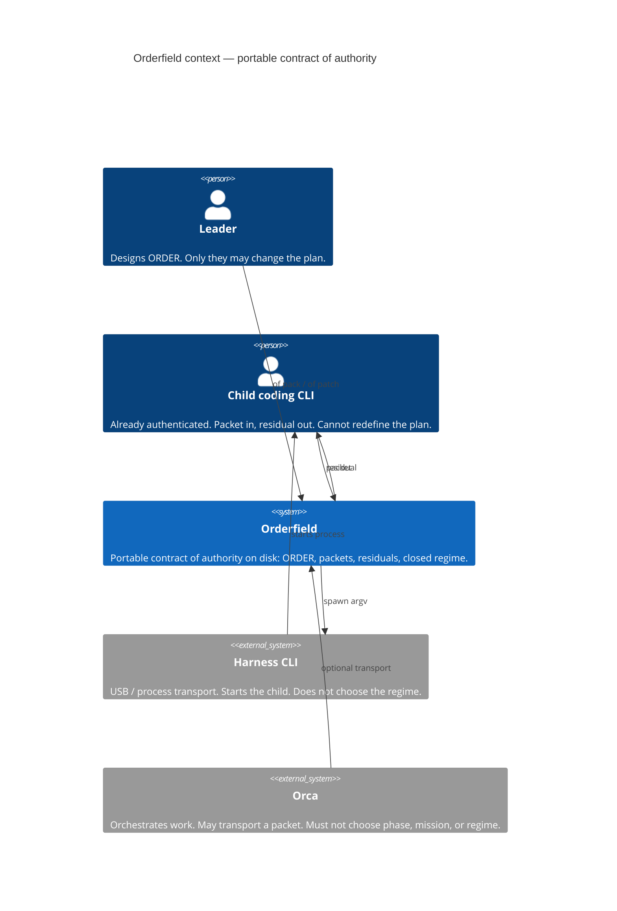
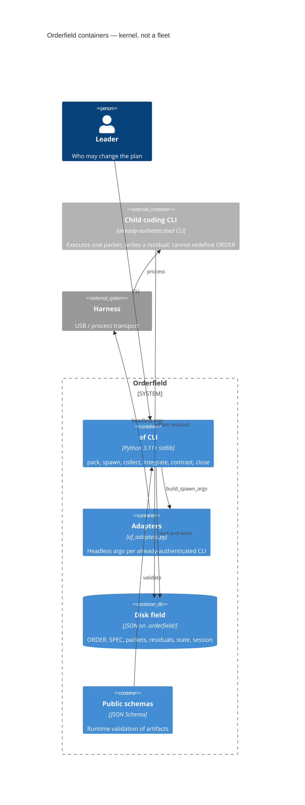
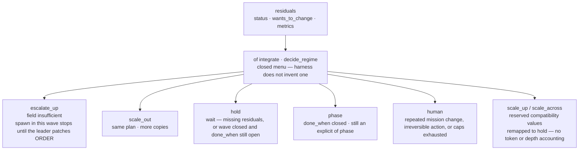

# Architecture — Orderfield kernel

The slow thing is the field on disk. The fast thing is the child CLI. Form docs do not invent a regime.

Architecture names who may change the plan, what the lock actually covers, and what stays reserved.

Map to `scripts/of/{field,spec,pack,regime}.py` and `scripts/of/cli/`. `MUTATING_COMMANDS` is the lock set — includes `spec` and `checkpoint`; not spawn, handoff, learn, or gc.

A cut, a resume, a different model — the shape holds. The results do not have to change.

> Hub: [AGENTS.md](../AGENTS.md) · Positioning: [README Compared-to](../README.md#compared-to) · Code: [`scripts/of.py`](../scripts/of.py), [`scripts/of/`](../scripts/of/), [`scripts/of_adapters.py`](../scripts/of_adapters.py)

**Status:** Active · **Stack:** Python 3.11+ stdlib · **Version:** `0.7.2` — see [`VERSION`](../VERSION)

## C4 — context, container, regime

The first public artifact is [README Compared-to](../README.md#compared-to). This page follows it. Names match that screen; this is not a second dialect.

Orderfield is a **portable contract of authority** across already-authenticated coding CLIs. The **harness** is USB: process transport that starts a child. It is **not a fleet**, **not an LLM graph**, and **not a vendor primitive**. Orca orchestrates work; Orderfield orchestrates **authority over the plan**.

| C4 view | Shows | Compared-to name |
|---------|--------|------------------|
| Context | Who uses the kernel, and what sits beside it | portable contract; harness is USB; not a fleet / graph / vendor primitive |
| Container | What the kernel is made of | stdlib CLI + adapters + disk JSON; harness starts processes |
| Regime | Closed menu after `of integrate` | who may change the plan; children cannot redefine ORDER |

Canonical contract words (ORDER, packet, residual, regime, contrast) stay in [docs/glossary.md](glossary.md). They are not redefined here.

### Context



Neighbors that are **not** Orderfield (same names as the README matrix):

| System | What it orchestrates | Orderfield is instead |
|--------|----------------------|------------------------|
| **Orca** | Work: process bus, workers, gates, DAGs | Authority over the plan. Orca may carry a packet; it must not choose the phase, patch the mission, or invent a regime. |
| **AWS CAO** | Vendor supervisor plus workers | Not a vendor primitive. Uses CLIs you already authenticated. No supervisor process, no AWS workflow. |
| **Claude Agent Teams** | Vendor fleet inside one harness | Portable across already-authenticated CLIs. ORDER remains if you turn Claude off. Not a team of processes. |
| **CrewAI / LangGraph** | An LLM graph: nodes, edges, tools, memory | Not an LLM graph. Children are coding CLIs with packets. The kernel is stdlib JSON plus a closed regime menu. |
| **Dual-harness skills** | Which runtime does the work | Who may change the plan. Multi-harness only if the user asks. |

Evidence can change the plan without swallowing child transcripts. Disk is the session.

### Container

Inside the kernel boundary: CLI, adapters, public schemas, and the disk field. The harness stays outside — it is the USB plug, not a container of the contract.



There is no worker pool, no model graph, and no vendor supervisor in this boundary. `of spawn` asks the harness to start one coding CLI with a packet already on disk. Caps bind at `of pack`. Product-file exclusivity is a pack/cut concern, not a kernel lock.

### Regime

After `of collect`, `of integrate` runs `decide_regime`. The harness does not invent a menu. Children vote with residual `status`, `wants_to_change`, and metrics; they do not select the next phase.



Who may change the plan:

| Signal | Who acts | What does **not** happen |
|--------|----------|---------------------------|
| Residual `done` | Leader integrates; regime may be `hold`, `phase`, or `scale_out` | Child transcripts are not ingested into ORDER |
| Residual `threshold` naming mission / phase / constraints / done_when / workspace | Kernel selects `escalate_up`; leader patches ORDER | Child does not rewrite the field; spawn in that wave stops |
| Reserved `scale_up` / `scale_across` | Remapped to `hold` | No fake telemetry, no process supervisor |

Loop on disk (same objects as the context diagram): leader → pack → packet → harness starts child → residual → collect → integrate → ORDER'. Compacted chat does not own this loop.

## Shape

One leader-designed field (`.orderfield/ORDER.json`) constrains fresh-context children through packets. The harness CLI is process transport; Orderfield is the disk contract and regime kernel.

```
leader → of resume → of pack → packet → of spawn|handoff → child → residual → of collect → of integrate → ORDER'
                 ↑ disk (SPEC.md lossless / packets / residuals / state / session.json) is the session
```

## Authority

| Concern | Owner |
|---------|--------|
| Mission / phase / constraints / done_when | Leader via `of patch` / `of phase` / `integrate --apply` (safe keys only) |
| Regime menu | `decide_regime` in kernel — closed set |
| Caps | Bind at `of pack` (and collect), not only spawn |
| Kernel state serialization | `.orderfield/field.lock` + atomic JSON replacement for mutating CLI commands |
| Packet/residual execution identity | Canonical live packet path + packet hash + exact ORDER revision + echoed residual identity |
| Phase/wave movement | Current integration digest, closure, revision-after-escalation, and in-flight guards |
| Product file exclusivity | Cut plan + constraints — **not** a kernel lock |
| Binding specification | `.orderfield/SPEC.md` current brief (original + amendments) + `spec_hash`; ingest is disposable; `spec-log` is episodic |
| Binding requirements | `.orderfield/REQUIREMENTS.json`; pack `--owns-requirement` (refused while unowned and the packet owns none); `of contrast` / `of close`; deliver blocked while UNOWNED / VERIFIED_INTERNAL / PAIR / FAILED |
| Role/workspace compliance and metric truth | Child/leader contract — values are shape-checked, not attested |

## Key modules (code)

| Symbol / area | Role |
|---------------|------|
| `scripts/of.py` + `scripts/of/{field,spec,pack,regime}.py` + `scripts/of/cli/` | Public CLI entry; 0.6 form split, 0.6.2 command groups (`init_cmd` / `ops` / `wave` / `field_cmd` / `spec_cmd`). Protocol unchanged vs 0.5.7 |
| `scripts/of_adapters.py` | `ADAPTER_ORDER` / `ADAPTER_BINS` / `ADAPTER_TOOLS` / `build_spawn_argv` / detect+pick |
| `done_when_for` / `mission_done_when` / `phase_done_when` / `done_when_closed` | Mission vs phase criteria; Option B prefixes + closed phases |
| `cmd_patch --done-when` / `--done-when-mission` / `--reopen` / `--constraints-rm` | Phase-scoped replace, reopen, prune |
| `cmd_unpack` | Release packed child that never reported; refunds `children_spawned` |
| `cmd_collect` + `integrate --partial` | Survive missing residuals; reduce what landed |
| `ORDER.harness` / `ORDER.backlog` | First-class fields (not prose constraints) |
| `validate_residual` | Reject malformed metric types/ranges before regime selection |
| `validate_public_schema` / `dump_json` | Runtime/public-schema parity and durable atomic JSON replacement |
| `field_lock` / `MUTATING_COMMANDS` | Cross-process serialization of kernel mutations; OS releases dead owners |
| `packet_digest` / `require_registered_packet` / `require_packet_artifact_paths` | Immutable packet identity, exact live revision, canonical paths, and symlink rejection |
| `validate_residual_for_packet` | Residual identity binding and existing in-project `done.result_ref` |
| `integration_input_digest` / `reconcile_integration_state` | Idempotent replay and interrupted-state repair; changed inputs use `--recompute` |
| `phase_transition_errors` / `wave_transition_errors` | Sequential closed phase movement and complete current-digest wave movement |
| `cmd_resume` / `cmd_checkpoint` | Session-cut: one-screen brief from disk; parked agents + `agents_note`; optional `--summary` |
| `session.json` auto-snapshot | Facts only: `wave`, `last_cmd`, `in_flight`, `updated_at` (+ optional summary). Written from pack/unpack/spawn/collect/integrate/patch/phase/next-wave/spec/close/gc/learn/migrate/checkpoint |
| in-flight | Packed child with missing residual; `of status` surfaces count; `of resume` lists `parked` + `parked_reason` |
| `render_prompt` / `INLINE_CONTRACT_ADAPTERS` | Reference-load field `.orderfield/SLAVE.md`; compact prompt ORDER view (id/rev/mission/phase/spec_ref); continuation note when scratch nonempty |
| `cmd_eval` | Recovery fixtures under `evals/recovery/`; optional `--kernel` unittest modules |
| `of --json` / `OF_JSON=1` | Optional machine-readable stderr events — see [events.md](events.md) |
| `cmd_pulse` | Child verdict from packet/scratch only; shared-repo mtime is display context, not child evidence; ORDER/state/session/wave artifacts stay unchanged, while update throttling may write its user cache |
| `cmd_doctor` | Local prereqs, adapter PATH/version, writable field, schemas, lock; PATH ≠ auth/ready |
| `cmd_learn` | Protocol lessons (user cache + field pin) vs field lessons (this ORDER). Resume lists both; render injects ≤8 protocol lines; not SPEC |
| `cmd_retain` / `cmd_gc` | Episodic keep/drop/dump; useful residuals and protocol learnings kept; inapplicable field learnings dropped; logs/history >30d dumped; never copies transcripts |
| `cmd_migrate` | Versioned rewrite of pre-0.4.2 packets/state and protocol writable aliases; does not invent integration hashes or rename `SLAVE.md` |
| `cmd_worktree` | Opt-in detached git worktree helper (`add`/`remove`/`list`); not a process manager; not hooked from spawn |
| `cmd_spec` / `cmd_spec_diff` / `cmd_contrast` / `cmd_close` | Binding-requirement ledger (index over SPEC: `origin` + line range), SPEC↔ORDER omissions, public-surface close gate (`VERIFIED_CONTRACT`; pair `--both-sides`) |
| `cmd_pack` `--owns-path` | Same-wave exclusive product paths; packet workspace union; not a file lock |
| `phase_deliver_errors` / verifier evidence | `--force` to deliver still requires SPEC close; verifier `done` needs identifying evidence |
| `RUNTIME_OWNERSHIP` / `RESERVED_REGIMES` | 0.5.0 decision encoded as reserve: `scale_up`, `scale_across`, tokens, `local_budget_pct`, inherited depth; no fake telemetry |
| `argv_preview` / `redact_text` | Secrets and escalated approval flags stripped from spawn previews and logs |
| `packets_all_stale` / `complete_stale_wave_recoverable` | Fully stale wave: `next-wave` without a report; complete stale wave may still integrate |
| `install.sh` + `of/SKILL.md` | Skill copies, static `/of` alias, and `of` PATH → installed kernel |

## Durability and concurrency boundary (0.4.2)

`MUTATING_COMMANDS` in `scripts/of/field.py` is the lock set: `init`, `new`, `pack`, `unpack`, `collect`, `integrate`, `phase`, `patch`, `next-wave`, `migrate`, `spec`, `checkpoint`, `close`. `spec` is inside the lock because it rewrites `ORDER.json` and `REQUIREMENTS.json` (the authority ledger); `checkpoint` because it rewrites `session.json`. `of.cli.main` takes one advisory OS file lock for those commands before calling the handler. JSON writes (`dump_json`) fsync a sibling temporary file, atomically replace the destination, then fsync the directory. Mutations that publish more than one field artifact (ORDER, state, session, REQUIREMENTS, packet, prompt, SPEC, phase Markdown, unpack tombstones) additionally stage one generation under `wal/<id>/`, write a MANIFEST (paths+hashes), then flip `wal/CURRENT.json` as the only reader-visible generation. Ordinary CLI readers (`status` / `resume` / `render`) recover through CURRENT. A crash before the pointer flip leaves the previous generation; a crash after it is coherent. Landed in [PR #45](https://github.com/pedroknigge/orderfield/pull/45) (WAL-001). Public JSON schemas stay the store.

Commands that also write artifacts but are **not** in that set — `spawn`, `handoff`, `gc`, `learn`, `worktree` — do not enter the lock wrapper. They still use atomic JSON replacement where they write JSON. The lock serializes cooperating mutations on the ORDER/state core path. It does not prevent a child or editor from modifying files directly, and it does not serialize product-code writes.

## Advisory and reserved fields

Runtime ownership is **reserved**, not implemented. `of status` prints the reserved set. `decide_regime` remaps any reserved regime to `hold`.

| Field/surface | Behavior |
|---------------|----------------|
| `budget.seconds` | Enforced as the spawned subprocess timeout |
| `budget.tokens` | Reserved; `of pack` writes 0; `--tokens N` for N>0 dies; not measured or enforced |
| `thresholds.local_budget_pct` | Reserved; not evaluated |
| `caps.max_depth` | Permission check for `--allow-nested`; inherited depth is not tracked |
| `scale_up` / `scale_across` | Reserved regime enums; decision logic never selects them from accounting |

No new telemetry. Removing a reserved field later requires a versioned migration. `workspace.writable_by_slaves` and `.orderfield/SLAVE.md` are frozen protocol keys (`of migrate` maps writable aliases onto the protocol key).

## Reversible field (0.3.0+)

| Move | Command |
|------|---------|
| Undo a pack that never reported | `of unpack --child-id <id>` |
| Collect despite stragglers | `of collect` prints `MISSING…`, exit 2; `of integrate --partial` |
| Reopen closure | `of patch --reopen` (or new `--mission` / `--done-when-mission`) |
| Drop a constraint | `of patch --constraints-rm <exact\|unique substring\|1-based index>` |

Detail: [references/principles.md](../references/principles.md), [references/adapters.md](../references/adapters.md). Ops: [troubleshooting.md](troubleshooting.md), [performance.md](performance.md). Audit: [docs/audit/claims-matrix.md](audit/claims-matrix.md).
